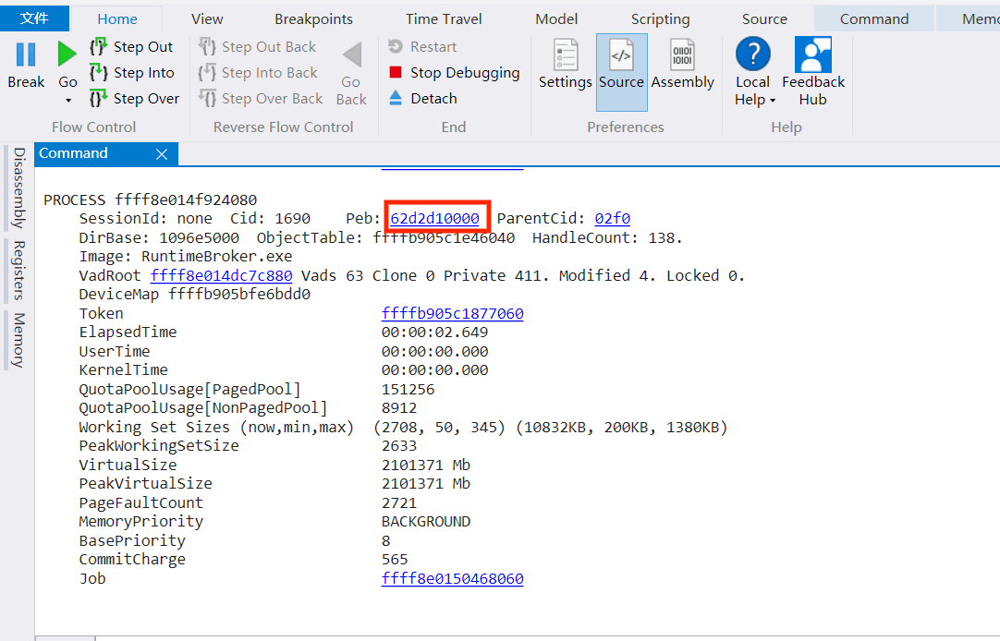
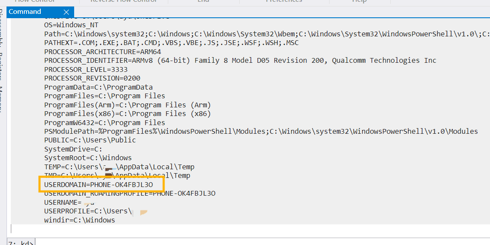
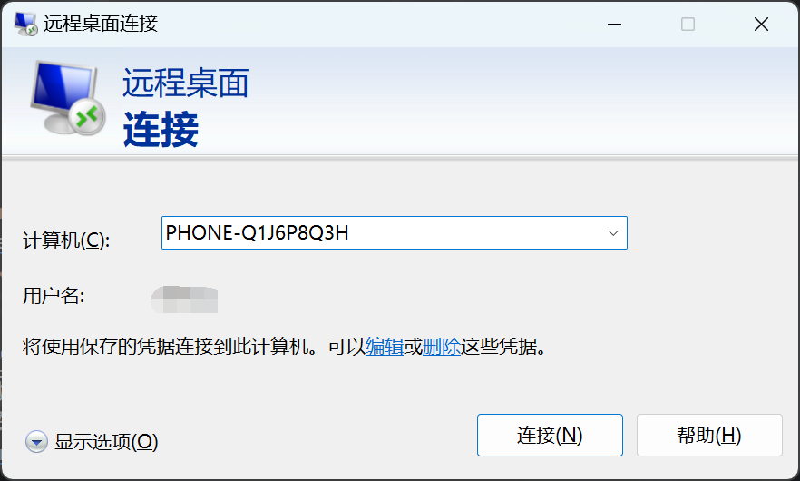
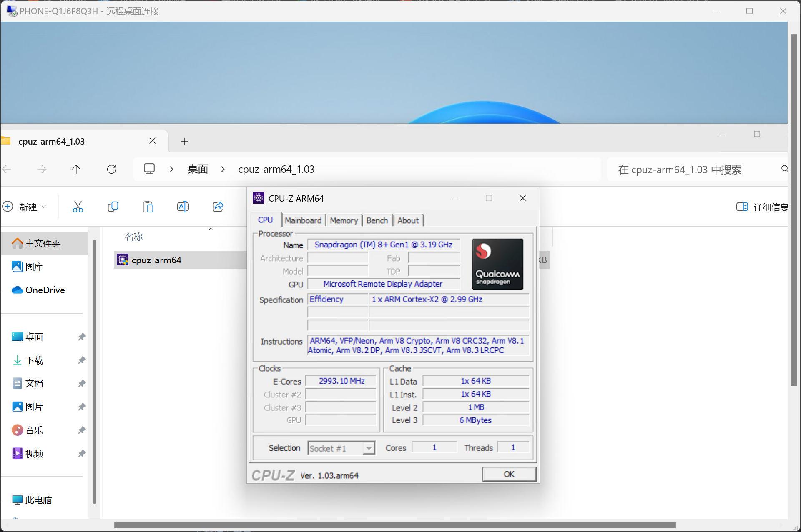

# Kdnet远程桌面
> 此方法适用于前期调试，可以通过KdNet连接到待测设备Win下的远程桌面测试触摸、USB等  
> 参考自[WOA Project](https://github.com/WOA-Project/)的相关教程和资料

## 准备
  - 一台刚刚释放完Windows的设备，还未启动过系统
  - ESP分区的ESP FLAG必须在Windows释放前已经被正确设置
  - 手机现在处于大容量模式且连接至电脑
  - 已经阅读完[KDNET配置教程](/zh/WindowsDebug/SetupKDNET.md)且至少完整操作过一次
  - 下载<a href="/WindowsDebug/KdNetRDP/unattend.xml" download>unattend.xml</a>

:::warning 注意
  无人值守只有在第一次启动时才会生效，请确认你是刚刚释放完成系统并安装完驱动。
  - 安装系统请参阅[Windows安装简述](/zh/InstallationGuides/WindowsInstallation.html)
  - 安装驱动教程请参阅[驱动安装](/zh/InstallationGuides/InstallDrivers.html)。
:::

## 配置无人值守
  - 打开文件资源管理器，找到手机的系统盘。
  - 进入`\Windows\Panther\`
  - 将刚才创建的`unattend.xml`复制到这里
    + 可选：你可以修改`unattend.xml`中的`LocalUser`为你想要的用户名
  - 弹出磁盘，手机重启，启动uefi。
  - 等待进入系统，正常流程是：
    + 转圈 -> 准备xxx -> 准备就绪 -> 自动重启
  - 自动重启后，再次启动uefi，正常流程是：
    + 转圈 -> 念诗OOBE -> 进桌面，用户为`LocalUser`
  - 注意上两步所有操作都是自动的，你只需要启动两次uefi
  - 如果在第一次启动时遇到了`Windows无法完成安装xxxxx点击确认重启`，请检查ESP FLAG是否设置，并重新安装Windows

## Windbg连接
  - 参考[此处](/zh/WindowsDebug/SetupKDNET.md#设置bcd)配置KDNET并连接
    + 如果中途自动`break`了，可以点击左上角的`Go`或在命令行输入`g`然后回车
  - 在手机进入系统后，点击Windbg窗口左上角`break`按钮，在窗口中间的命令行中输入`!process 0 1`并回车，等待输出完毕
  - 随便找一个Process，点击`Peb`后面的蓝色数据，Windbg会执行命令并输出一大堆内容。
    
  - 在输出的内容中找到`USERDOMAIN`， 复制后面的内容，一般为为`PHONE-XXXXX`或`DESKTOP-XXXX`
    
  :::tip
    如果点开一个Peb里面没有USERDOMAIN的话， 可以考虑换一个Process的Peb
  :::

## RDP连接
  - 打开Windows自带的RDP工具`远程桌面连接`， 你可以在开始菜单搜索到， 或者按`Win+R`在运行窗口输入`mstsc`
  - 输入刚才复制的`USERDOMAIN`， 填入计算机一栏中，点击连接
    
  - 用户名为`LocalUser`， 或者你在`unattend.xml`中自定义的用户名。
  - 没有密码，输入用户名连接即可，如果提示证书不对，点击忽略确认即可。
  - 如果远程桌面连接窗口成功连接到系统，则一切配置完成，开启你的调试之旅吧！
    

## 参考链接
 - [MSDN: 应答文件](https://learn.microsoft.com/zh-cn/windows-hardware/manufacture/desktop/update-windows-settings-and-scripts-create-your-own-answer-file-sxs)