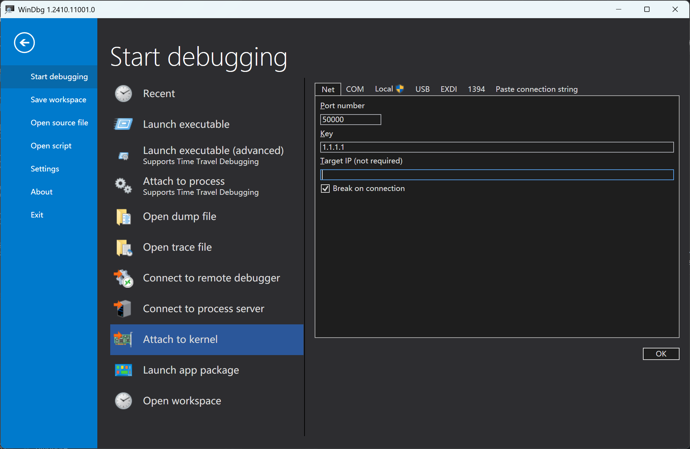

# 配置Windbg KDNET

## 准备工具
  - 一台已经释放完windows且已经修复完ESP分区的手机
  - UEFI镜像
  - 一台Windows系统的电脑（或者另一台WOA的手机，随便你）
  - 安装[Windbg Preview](https://apps.microsoft.com/detail/9pgjgd53tn86)
  - USB数据线，2.0或者3.0无所谓

## 设置BCD
  - 找到手机里面ESP分区内的/EFI/Microsoft/Boot/BCD （路径不区分大小写）
    + 你可以采用大容量模式挂载ESP分区获取[BCD](https://learn.microsoft.com/zh-cn/windows-hardware/manufacture/desktop/bcd-system-store-settings-for-uefi)文件，也可以采用安卓/REC挂载的方式获取BCD
    + 以下举例安卓/REC挂载获取的方法，假定你的ESP分区的label是esp:
    ```bash
    # 在手机上以root权限执行:
    mkdir /dev/esp_mnt
    mount /dev/block/by-name/esp /dev/esp_mnt
    cp /dev/esp_mnt/EFI/Microsoft/Boot/BCD /sdcard
    ```
    ```powershell
    # 在电脑的终端中执行，请确保你已经安装adb并配置了环境变量
    adb pull /sdcard/BCD D:\
    ```
  - 在电脑上打开一个**具有管理员权限**的终端，并设置调试模式：
    ```powershell
    cd D:\
    bcdedit /store BCD /set "{default}" testsigning on
    bcdedit /store BCD /set "{default}" nointegritychecks on
    bcdedit /store BCD /set "{default}" debug on 
    bcdedit /store BCD /dbgsettings net hostip:169.254.255.255 port:50000 key:1.1.1.1
    ```
  - 将BCD复制到手机上的ESP分区中
    ```powershell
    # 在电脑的终端中执行，请确保你已经安装adb并配置了环境变量
    adb push BCD /sdcard
    # 在确认已经推到手机以后，删除D:\BCD
    del D:\BCD
    ```
    ```bash
    # 在手机上以root权限执行:
    cp /dev/esp_mnt/EFI/Microsoft/Boot/BCD /dev/esp_mnt/EFI/Microsoft/Boot/NMBCD
    cp /sdcard/BCD /dev/esp_mnt/EFI/Microsoft/Boot/DBGBCD
    cp /sdcard/BCD /dev/esp_mnt/EFI/Microsoft/Boot/BCD
    ```

### Windbg KDNET 配置
  - 打开Windbg(新版)，点击左上角**文件**
  - 点击`Start Debugging`下面的`Attach to kernel`
  - 点击`Net`
    + 在`Port Number`输入`50000`
    + 在`Key`中输入`1.1.1.1`
  
  - 点击下方的`OK`
  

### 连接手机
  - 手机重启到fastboot，连接电脑
    ```powershell
    # 在电脑上执行
    fastboot boot brand-codename.img
    ```
  - 手机会启动到Windows，但不会转圈，此时Windows在等待Windbg连接
  - 你可以在**任务管理器**或者**设备管理器**中找到名字叫做`Kdnet EEM`的网络设备
  - 大约几分钟后，Windbg连接成功，手机上的windows开始加载
  - 你可以在还未连接的时候使用`Ctrl+Alt+V`打开verbose mode，查看驱动加载状态
  